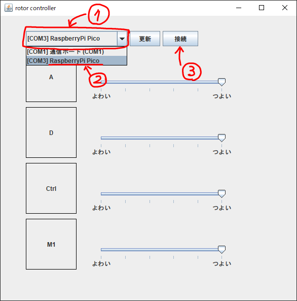
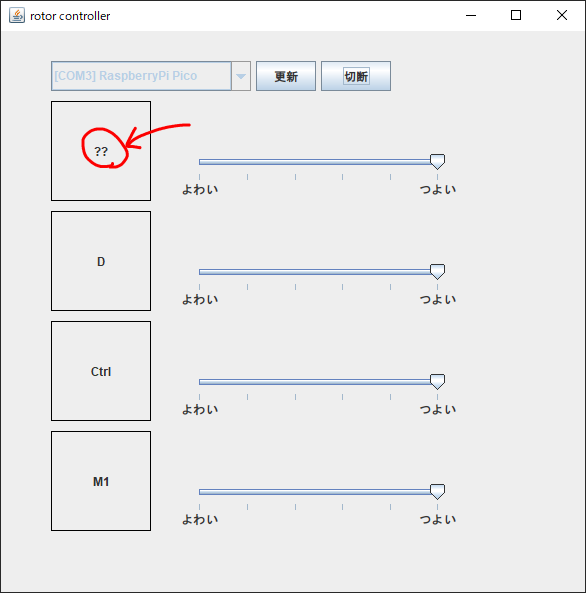

# Rotor Controller

## 使い方
### 実行
githubのreleaseからjarをダウンロードする(以下のリンク)  
[https://github.com/Non-Sense/rotor-controller/releases/download/v1.0/rotor-controller-1.0-all.jar](https://github.com/Non-Sense/rotor-controller/releases/download/v1.0/rotor-controller-1.0-all.jar)  
ダブルクリックして実行(前提条件: Javaがインストール済み)  

### コントローラとの接続
1. ドロップダウンをクリック
2. `RaspberryPi Pico`と名前がついているものを選択
3. `接続`をクリック

### キーバインドの変更
1. 変更したいキー/マウスボタンの黒枠内をクリック
2. 枠内文字が`??`になったことを確認
3. バインドしたいキー/マウスボタンを押して離す

